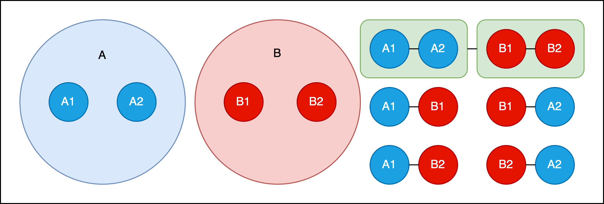
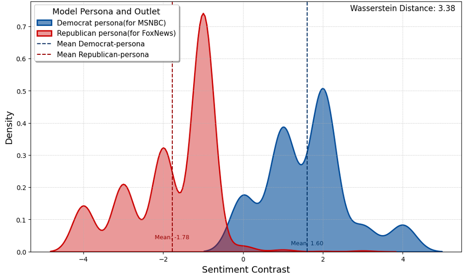

This repository contains the code and data for our paper:

# Dialectic Intersubjectivity Conceptual Model

# Sentiment Contrast Wasserstein Distance for Like-minded Analysis

# Sentiment Contrast Wasserstein Distance for Cross-cutting Analysis

